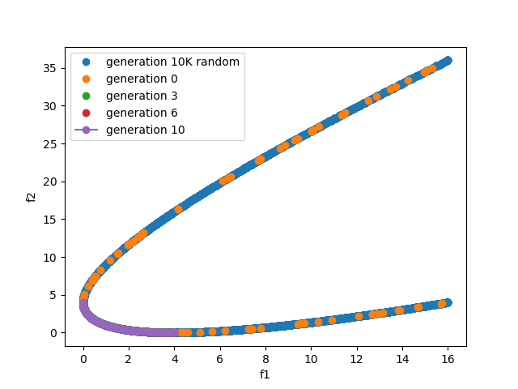

# Multiobjective optimization using nondominated sorting-based genetic algorithm (NSGA-II)

This repository includes a [notebook](NSGA-II.ipynb) that shows a Python implementation of [NSGA-II](https://ieeexplore.ieee.org/abstract/document/996017?casa_token=pEj5es5El6QAAAAA:viir5gQ55UmNLiGOWQSeV8daGZzZ_Ffwsp9g8rwA6p3X2i4nk4JGNn-PwLO4NZehpHy6G-Fy) developed by Deb et al in 2002. 

## Files

- `README.md` this file.
- `nsga-ii.ipynb` is the Jupyter notebook detailing how the algorithms are implemented.
- `nsga2.py` the Python file that contains the implementation of both NSGA-II and a binary coded genetic algorithm.
- `Figure_1.png` is a screenshot of running the application (see below).

## Usage

```
>>> from nsga2 import *
>>> def evaluator(vars):
...     # need 1 variable
...     x = vars[0]
...     f1 = x**2
...     f2 = (x-2)**2
...     return [f1, f2]
... 
>>> N = 100
>>> T = 10
>>> numvar = 1
>>> varlen = 10
>>> bounds = [[-4, 4]]
>>>
>>> crossover_prob = 0.9
>>> mutation_prob = 1/numvar/varlen
>>> P = nsga2_x(N, T, crossover_prob, mutation_prob, numvar, varlen, bounds, decoder, evaluator)
```

The following shows how to plot the results.

```
>>> import matplotlib.pyplot as plt
>>> 
>>> P['10K random'] = [solution(numvar, varlen, bounds=bounds, decoder=decoder, evaluator=evaluator) for _ in range(10000)]
>>> for i in P['10K random']:
...     i.evaluate()
... 
>>> toplot = ['10K random', 0, T//30, 2*T//30, T]
>>> for i in toplot:
...     x1 = [(p.obj[0], p.obj[1]) for p in P[i]]
...     x1.sort()
...     marker = 'o'
...     if i == toplot[-1]:
...         marker = 'o-'
...     plt.plot([i[0] for i in x1], [i[1] for i in x1], marker, label=f'generation {i}')
>>> plt.xlabel('f1')
>>> plt.ylabel('f2')
>>> plt.legend(loc='upper left')
>>> plt.show()
```

Below is an example of the plot.

